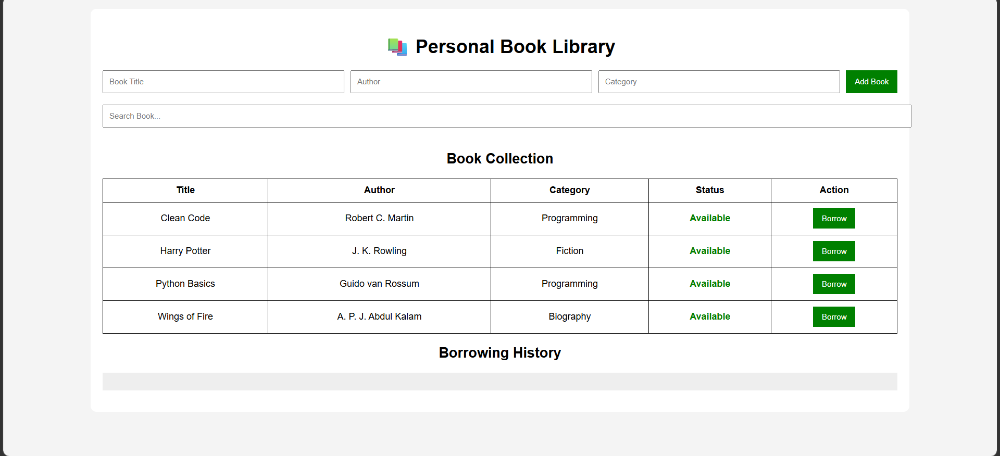

# 📚 Personal Book Library

## 📖 Description

The **Personal Book Library** is a simple and interactive web application developed using **HTML5, CSS3, and JavaScript**. It helps users organize and manage their personal book collection in one place. Users can add books, search for books, categorize them, borrow or return books, and view borrowing history. The application stores data using the browser's Local Storage, so the information remains available even after refreshing the page.

---

## ✨ Features

- ➕ Add New Books
- 🔍 Search Books by Title
- 📂 Categorize Books
- 📖 Borrow and Return Books
- 📝 Edit Book Details
- ❌ Delete Books
- 📜 Borrowing History
- 💾 Local Storage Support

---

## 🛠️ Technologies Used

- HTML5
- CSS3
- JavaScript

---

## 📁 Project Structure

```
CrixsoftSolution_BookLibrary/
│── index.html
│── style.css
│── script.js
│── output.png
│── README.md
```

---

## 📷 Project Output



---

## 🚀 How to Run the Project

1. Download or clone this repository.
2. Open the project folder.
3. Open **index.html** in any web browser.
4. Start managing your personal book library.

---

## 📚 Project Explanation

This application allows users to maintain a digital collection of books. Users can enter a book title, author name, and category to add books to the library. The search feature helps users quickly find books by title. Books can be borrowed or returned with a single click, and every borrowing activity is recorded in the borrowing history section. The application uses JavaScript Local Storage to save data, ensuring that the book list remains available even after the browser is refreshed.

---

## 👩‍💻 Author

**Babavali**  
B.Tech Final Year (Artificial Intelligence & Machine Learning)

---

## 🙏 Acknowledgement

This project was developed as part of the **Crixsoft Solution Web Development Internship**.
